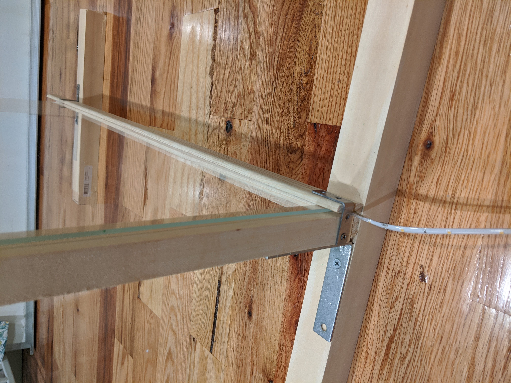

## Lightboard instruction
This is the goal:

Key feature:

* Portable
* Easy to adjust size
* Easy to interchange glasses during presentation so you don't have to erase all the time (good for statements of definitions/theorems).

### Requirements

| Items         | Price     |
|----           | ----      |
|Clear dry erase acrylic sheet   |   $48 for 36" x 30" or $12 for 18" x 24" |
|Commericial Electric 8ft white LED light   |20.37  |
|36 inch Wooden L-shape wall mould | $9.5 |
|1" x 1" x 36" square dowel | 3.68 |
|1-3/4" x 1-3/4" x 36" square dowel | $9.6 |
|4" Corner brace   | $8    |
|1.5" corner brace | 4.98   |
| Total | $104.13 for 36" x 30" or $68.13 for 18" x 24" |

* Note that I've tested and found out that polycarbonate sheet doesn't work and traditional clear glass doesn't work as well.
* Prices are from Home Depot
* There are some leftovers that could be used to create another board so the price would be cheaper if 2 people share the parts.

## Installation

Please follow the following instructions.

The final product should look like this (please note the two sides)

## Acknowledgement
This project was generously supported by [Jason Howell](https://www.cmu.edu/math/people/faculty/howell.html).

## References
1. [USC professor’s DIY online teaching hack to engage students goes viral](https://news.usc.edu/174170/emily-nix-usc-professors-diy-online-teaching-hack/)

2. [How I Make a Lightboard | Billy Backstage](https://www.youtube.com/watch?v=2mf03HhlE6E)